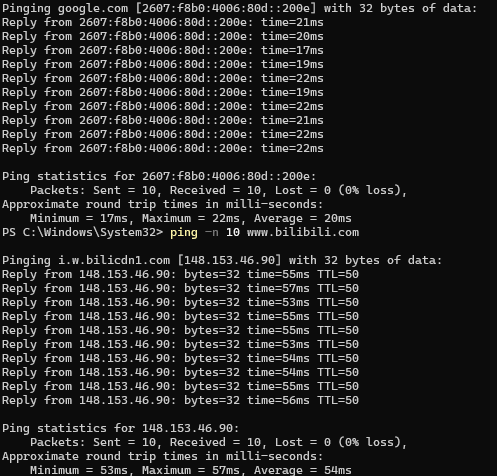
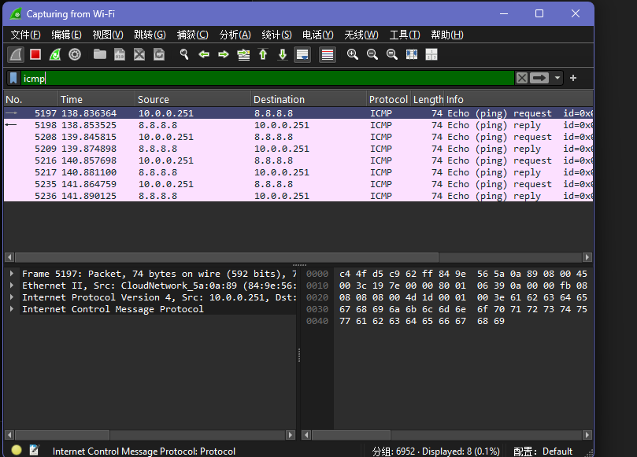

# Week 01 — Ping, Traceroute, and Wireshark (ICMP)

## Goal
The goal of this experiment is to observe how packets travel across the Internet using `ping`, `tracert`, and Wireshark, and to understand the roles of ICMP messages and TTL in network communication.

---

## Setup
- Operating System: Windows  
- Tools Used: PowerShell (`ping`, `tracert`), Wireshark  
- Test Targets:
  - google.com  
  - www.bilibili.com  

---

## 1) Ping Tests

### Command Used
ping -n 10 google.com
ping -n 10 www.bilibili.com

### Result Screenshot

### Observations
- The RTT values are different for different destinations.
- The server that is farther away shows higher delay.
- There is no packet loss in this test, which means the connection is stable.

---

## 2) Traceroute Tests

### Command Used
tracert google.com
tracert www.bilibili.com

### Screenshot

### Observations
- Multiple hops can be seen between the local machine and the destination.
- Some hops may not respond and show `* * *`, probably because routers block ICMP replies.
- The distant website generally has more hops than the closer one.

---

## 3) Wireshark ICMP Capture

### Filter Used
icmp

### Procedure
Wireshark was started on the active Wi-Fi interface.  
While capturing packets, the following command was executed:

ping -n 4 8.8.8.8

### Screenshot

### Observations
- ICMP Echo Request (Type 8) and Echo Reply (Type 0) packets were observed.
- The TTL field decreases as packets pass through routers, preventing infinite routing loops.
- Sequence numbers increase with each request, confirming packet order.
- Packet-level inspection reveals protocol details not visible from command-line tools alone.

---

## Conclusion
This experiment demonstrates how ICMP is used to test connectivity and measure latency, and how traceroute reveals routing paths through TTL expiration.  
Wireshark enables direct inspection of packet headers and protocol behavior, providing deeper insight into real network communication.

---

## Files Included

